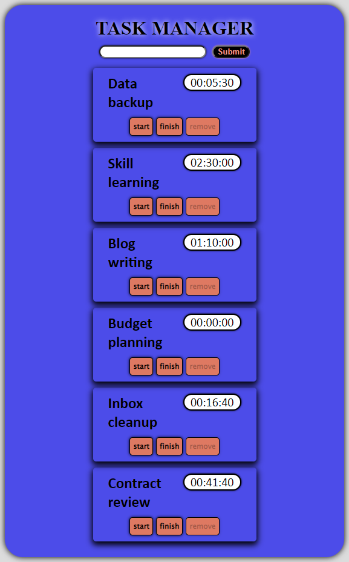
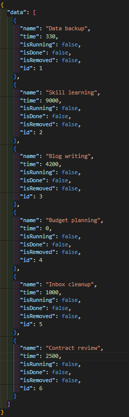

# Task manager with timer

This is a task manager application built using React. It includes a timer feature and utilizes a JSON server to simulate a database for storing data. The application allows you to manage your tasks by:

- Running one task at a time, while disabling other tasks' buttons
- Starting and stopping a task, which starts/stops the timer
- Finishing a task, moving it to the end of the list and making it non-restartable
- Removing tasks, which removes them from the list but keeps them in the database as removed.

|

## Installation

To run this application, you will need to have Node.js and npm (Node Package Manager) installed on your machine.

- Clone the repository

            git clone https://github.com/MaxDobisz/Task-manager-with-timer-React.git

- Install the dependencies

            npm install

- Install json-server globally

            npm install json-server -g

- Start the JSON server by running

            json-server ./data.json --watch

It is important to note that the JSON server must be running on localhost:3000.
You must run json server first before running the app.

- Start the application in another terminal

            npm start

## Technologies used
- React with class components for building the user interface
- JSON server for simulating a database
- Fetch for making API requests
- Promises chaining for handling asynchronous actions
- BEM methodology for naming CSS classes

## Future Improvements
- Adding authentication and authorization to the application
- Implementing a real database to store data
- Integrating a calendar view for better task scheduling
- Adding a feature for setting task priorities
